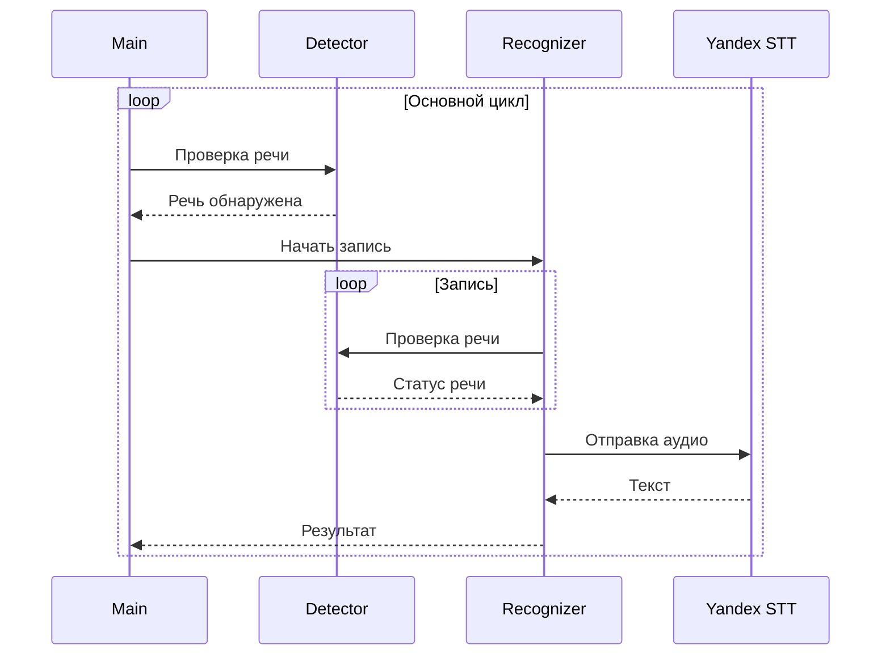

# 🎤 Жора - Голосовой Помощник

Простой и эффективный голосовой помощник, использующий Silero VAD для детекции речи и Яндекс SpeechKit для распознавания.

## 🏗️ Архитектура

### Компоненты системы:
1. **Детектор речи (detector.py)**
   - Использует Silero VAD для определения речи в аудиопотоке
   - Работает с фиксированными окнами по 512 сэмплов (16кГц)
   - Возвращает True когда обнаружена речь

2. **Распознаватель (recognizer.py)**
   - Записывает аудио пока детектор слышит речь
   - Останавливает запись после 0.5 секунд тишины
   - Конвертирует WAV в OGG для отправки
   - Отправляет аудио в Яндекс STT
   - Возвращает распознанный текст

3. **Главный модуль (main.py)**
   - Инициализирует компоненты
   - Управляет жизненным циклом программы
   - Связывает детектор и распознаватель

### Процесс работы:

## 🛠️ Технологии
- **Python 3.x** - основной язык
- **Silero VAD** - нейросеть для детекции речи
- **PyAudio** - запись аудио
- **sounddevice** - работа с аудиопотоком
- **Яндекс SpeechKit** - распознавание речи
- **OpusTools** - конвертация аудио

## 📦 Зависимости
- portaudio - библиотека для записи звука
- opusTools - конвертация в OGG формат
- torch - для Silero VAD
- numpy - обработка аудио данных
- sounddevice - работа с аудиопотоком
- pyaudio - запись аудио
- grpcio-tools - gRPC для Яндекс SpeechKit

## 🚀 Запуск
1. Клонируем репозиторий
2. Входим в nix-shell
3. Запускаем: `python src/main.py`

## 🔧 Настройка
Необходимые переменные окружения:
- `YANDEX_FOLDER_ID` - ID каталога в Яндекс Облаке
- `YANDEX_OAUTH_TOKEN` - OAuth токен Яндекса

## 📝 TODO
- [ ] Добавить шумоподавление, если Silero не хватит
- [ ] Улучшить определение конца речи, если Silero не хватит
- [ ] Добавить режим диктовки
- [ ] Добавить обработку команд
